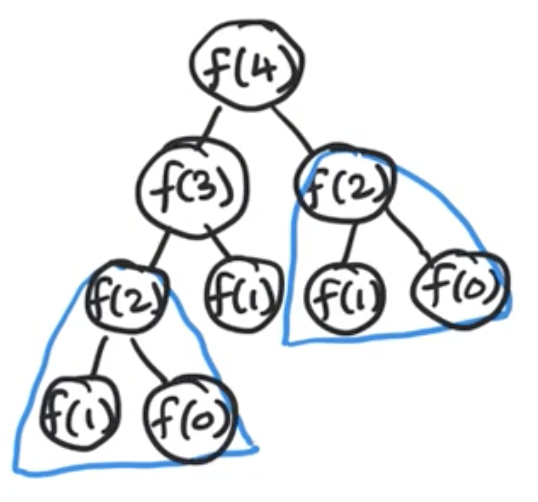
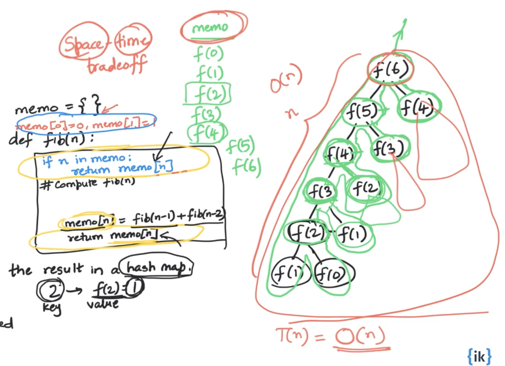
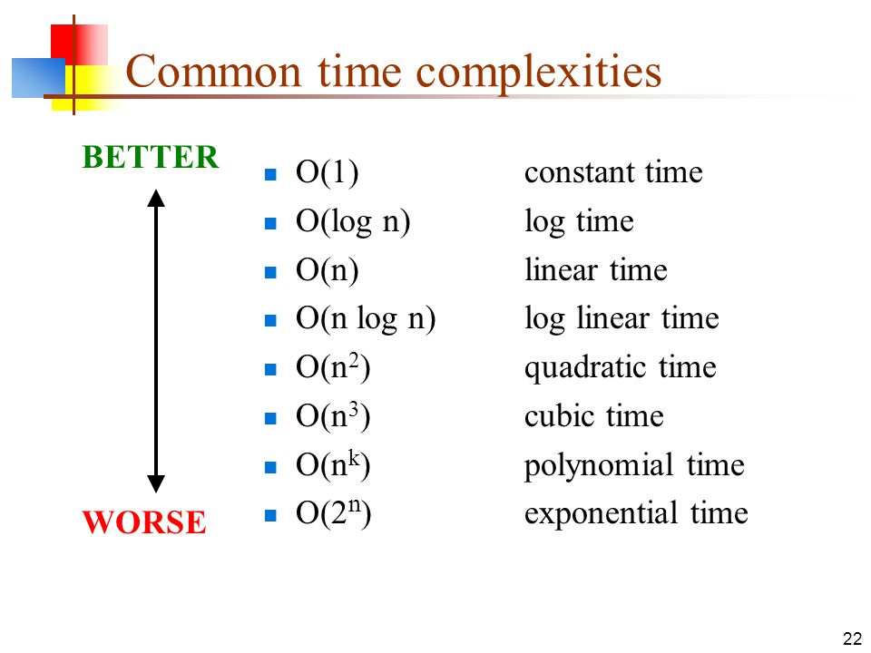
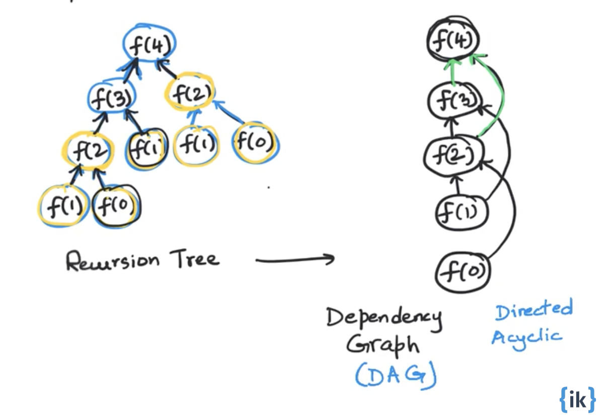

# Dynamic Programming Foundation

## Dynamic Programming Introduction

<details>
  <summary>View Notes</summary>

**Definition:** DP is recursion without repetition

**Fib Example:**

*Original:*

``` swift
func fib(n: Int) -> Int {
	if n == 0 || n == 1 {
		return n
	}

	return fib(n-1)+fib(n-2)
}
```


- We can notice that in this tree there is repeating fib(3), feb(2), etc
- Many sub-problems appear multiple times

**Goal:** Avoid repeated work; each subproblem must be evaluated only once

**Expectations:** The naive recursive implementation took exponential time
	- because of the repeated work. 
	- Avoiding the repeating work should make execution much faster
	- Current state: expontial time

### Introduciton Quiz:
> The Tribonacci sequence Tn is defined as follows:
> T0 = 0, T1 = 1, T2 = 1
> Tn = Tn-1 + Tn-2 + Tn-3
> Consider the following recursive code which implements the mathematical definition:
>
> What is the running time complexity of this implementation?

**A:** Some exponential in n

</details>


## Top-down Memoization

<details>
  <summary>View Notes</summary>





*Original:*

``` swift
func fib(n: Int) -> Int {
	if n == 0 || n == 1 {
		return n
	}

	return fib(n-1)+fib(n-2)
}
```

- The original code was done ina depth first search
- Traversal can be done in in-order, pre-order and post-order
 
What if we stored the result in a hash map:

| key | f(n) = v |
|-----|----------|
| 2   | f(2) = 1 |

- This is called memorandum or memo; something to be remembered but in CS it's called Memoization

``` swift
var memo = [Int: Int]() // hashmap

func fib(_ n: Int) -> Int {
	// it's stored so use it
	if let value = memo[n] {
		return value
	}

	// compute fib(n)
	if n == 0 || n == 1 {
		return n // these are leaf nodes, so no need to store these
	}

	memo[n] = fib(n-1)+fib(n-2)
	return memo[n]!
}
```

**Steps from above code:**
1. we check if it's stored
2. Compute `fib(n)` & store it

**Alternative**

``` swift
var memo = [Int: Int]() // hashmap
memo[0] = 0
memo[1] = 1

func fib(_ n: Int) -> Int {
	// it's stored so use it
	if let value = memo[n] {
		return value
	}

	memo[n] = fib(n-1)+fib(n-2)
	return memo[n]!
}
```

- Still a top-down following DFS 

**Time Complexity:** `O(n) func`

**Space Complexity:** `O(n)` because of memo
	- space trade off for better T(n)



---

### Top-down Memoization Quiz:

> **Q-1:** What is the running time complexity of this code for calculating the nth Tribonacci number, in terms of n?

**A:** Linear

> **Q-2:** Dynamic programming has the potential to transform exponential-time algorithms to polynomial time.

**A:** True - This was shown via the example of calculating fib(n) or tribonacci(n). 



I got Q-2 wrong, so here's an examply of all the `T(n)`
- Polynomial time is `n^k`
- Exponential time is `2^n`

> **Q-2:** Memoization can only be done by using a hash table data structure, not a simple array. 

**A:** False - As long as it's accessable via constant time, it won't be an issue

### End of section summary:

1. Using memoization we can drastically cut down run time
2. In the case of Fib originally being exponential we were able to cut it down to linear
3. Memoization can be Hash table or array, constant time access is key
4. This was a top-down memoization meaning we check memo at the start of DFS
	- but add it to memo when returning the value back up

Simplest example:

``` swift
let memo = [Int: Int]()

func dfs(_ n: Int) -> Int {
	if let val = memo[n] { return val }

	// some case when n isn't set

	memo[n] = dfs(n)
	return memo[n]!
} // this is an inf loop but just the idea
```

</details>

## Bottom up Tabulation

<details>
  <summary>View Notes</summary>

- A bottom up soltion - prefered by most interviewers
	- and will be what is used most of the time at IK
- Tabulatoin - bottom-up

*Original:*

``` swift
func fib(n: Int) -> Int {
	if n == 0 || n == 1 {
		return n
	}

	return fib(n-1)+fib(n-2)
}
```

^ exponental

*Dependency graphs - Bottom up:*

- "collapse" them into unique nodes
	- No longer using recursion trees but instead using dependency graphs
- A directed graph and Acyclic
- `Acyclic` - because each node only depends on smaller problems
	- it'll never have a cycle
- Making this a `DAG` -> `Dependency Acyclic Graph`



Stopped @ 5:30

</details>