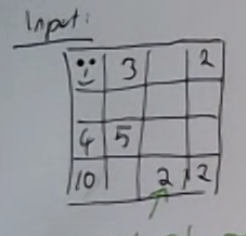
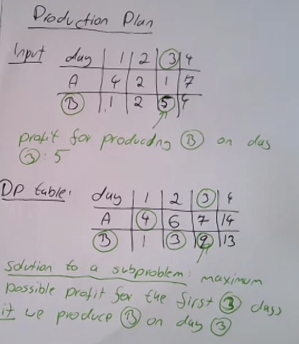
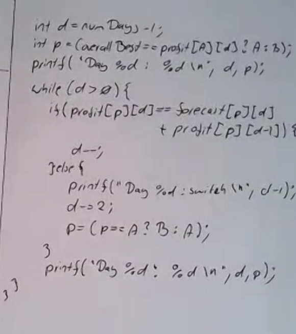
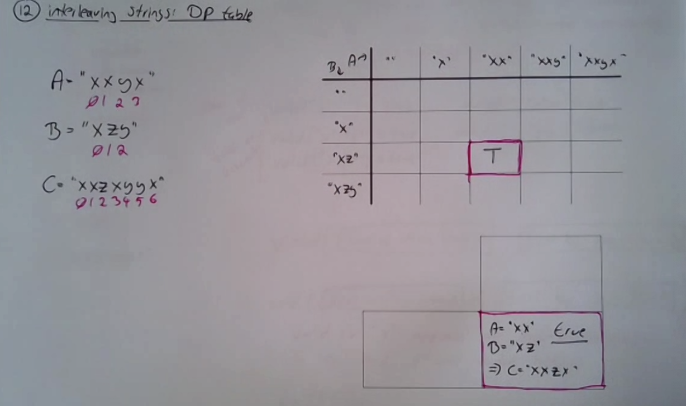
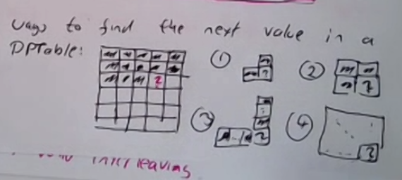

# Live Dynamic Programming Class with Tilo

## Class Agenda: 

1. Permutation-style problems (e.g, Rod cutting)
2. Combination-style problems (e.g, Knapsack or Subset Sum)
3. Permutation-style problems on TWO inputs (e.g, Edit Distance)


## Dynamic Programming - theory to solve problems

<details>
  <summary>View Notes</summary>

There are 2 formal properties of DP:

1. Optimal Substructure:
	- the solution to the subproblem doesn't change
	- if it doesn't change, we can store it (memoize it)
2. Overlapping subproblems:
	- the solution to at least one subproblem is used more than once
	- memoization is a good use of memory
		- pascals triangle (it's a directed graph)

- Recursion is implied.

### Solving DP prolems in an interview:

- missing a DP problem doesn't make you stand out
	- it shows you are confident in coding
	- rushing to a recursion solution and programming means you may have missed the DP
		- which means maybe the problem was too easy and might make the next question they give you even hearder
- it's better to have an opinion than ask if you should use DP

a. writing code in *recursion* and you notice repeating structures
	- memoization (but has short coming)
		- `is it computed use it or not, if not store it`
	- bottom up
b. start by reasoning about the structure of the *recursive* PD table
c. write a recurrence (*recursive* formula) by using from proof by induction

- *recursion* is at heart of DP

What if we can't figure out the recursive solution?

### Solving *hard* problems in 45 minutes

Stages of problems:

1. Easy: you know what to do
2. Medium: I know some patterns that can be tried
3. Hard: No immediate idea

- just throwing out an idea or pattern means nothing

### How to get out of panic mode *(Mainly for DP)*

- Stay calm and take an inventory of what I *do* know
	- Examples:
		- problem size can be reduced
		- solution for a special case / small case is obvious
	- Typical DP questions contain words:
		- counting
		- optimization (min, max)
		- validate the structure (there's a rule does the input follow that rule?)
- Solve examples:
	- you have the time don't skip it
	- treat every example as a puzzle
		- every example can be solved by a 12 year old
	- use the language of the problem 
	- if you suspect DP, do examples small to large

</details>


## The interview process

<details>
  <summary>View Notes</summary>

- 45 minutes or less
	- 5 minutes for chit-chat
	- 50% to find the solution
	- 50% to code the solution

In a few months you can learn more patterns but you can't really improve your problem solving speed. So finding the solution is going to 50% or more, you can't improve this.

but you can get faster at coding.

```
The ultimate goal is to program the solution in 10 minutes or less
```

So when doing these practice problems, take 45 minutes and time yourself.

### rules for practice

1. set a timer and give yourself `x` minutes for solution & `y` minutes for code.
	- if you can't do it then you failed the question. which means more problems 
2. don't use a debugger. in an interview you'll never get a debugger
	- don't print
3. don't look at the solution (guilty)
	- looking a solution turns a hard question to a medium and medium an easy. which means you can't got back and do the problem again 

If you're not doing this you're holding yourself back

</details>


## 1. American Football scores - counting

<details>
  <summary>View Notes</summary>

### American Football scores

Possible scores: `[2, 3, 6]`

Question: Given a final score "S", how many ways are there to reach "S"

Example: 

``` c
S = 7

1. 2->2->3
2. 2->3->2
3. 3->2->2

Answer: 3
```

1. Can the problem size be reduced?
	- s = 5 and 2+3 or 3+2, so 2
	- s = 2 and 2, so 1 but too little info because of s = 3 then the answer isn't possible
	- keep using the language "american football" and "score"

2. Do self example problems:

| score   | 0 | 1 | 2 | 3 | 4 | 5 | 6 | 7 | 8 |
|---------|---|---|---|---|---|---|---|---|---|
|# of ways| 1 | 0 | 1 | 1 | 1 | 2 | 3 | 3 | 6 |

- how many of 0? 
	- initially I thought 0 
	- but because of the language of the problem a game can end with no points

- 6 = 6, 2+2+2, 3+3 = 3
- 7 = 2+2+3, 2+3+2, 3+2+2 = 3 

3. How did we solve it using examples?
	- and formulate an algo to do the same thing we did as a humman
	- for DP find the recursion <- if i can do this I'm done

Solving for 8 using previous answers
- using the scores what scores previously occurred and take their count

``` c
8-2=6 [2->2-2]->2 = 8
	  [3->3]-> 2 = 8
	  [6]->2 = 8

8-3=5 [2->3]->3
	  [3->2]->3

8-6=5 [2]->6 

Total: 6
```

So we can formulate:
`row(s) = row(s-2)+row(s-3)+row(s-6)`

wrap this into a loop and we have the answer.

### My solution:

``` swift
func possibleScores(finalScore: Int, points: [Int]) -> Int {
    
    var table: [Int] = Array(repeating: 0, count: finalScore+1)
    table[0] = 1
    
    for i in 0...finalScore {
        for j in 0..<points.count {
            if points[j] > i { continue } // not >= because table is finalscore+1

            table[i] = table[i] + table[i-points[j]]
        }
    }
    return table[finalScore]
}

let scores = possibleScores(finalScore: 0, points: [2,3,6])
print(scores)
```

**Time complexity:** O(s*p)

**Space complexity:** O(s)

### Teacher 1-solution:

``` swift
func americanFootball(_ finalScore: Int) {
	if finalScore < 0 { return 0 }

	var table: [Int] = Array(repeating: 0, count: finalScore+1)
	table[0] = 1 // base case

	for s in 0...finalScore {

			table[i] = (s>=2 ? table[s-2] : 0)
					+ (s>=3 ? table[s-3] : 0)
					+ (s>=6 ? table[s-6] : 0)
			// the teacher hard coded all the [2,3,6] 
	}

	return table[finalScore]
}
```

**Time complexity:** O(s)

**Space complexity:** O(s) but could be O(1)

### Teacher 2-solution:

``` psuedocode
func americanFootball(_ finalScore: Int) {
	if finalScore < 0 { return 0 }

	var table: [Int] = Array(repeating: 0, count: 7)
	table[0] = 1 // base case

	for s in 0...finalScore {

			table[s%7] = (s>=2 ? table[(s-2)%7] : 0)
					+ (s>=3 ? table[(s-3)%7] : 0)
					+ (s>=6 ? table[(s-6)%7] : 0)
			// the teacher hard coded all the [2,3,6] 
	}

	return table[finalScore%7]
}
```


- mod-ing the maximum in the score

- pay special attention to off by 1 errors
	- double check

</details>


## 2. Production plan - Optimization problems

<details>
	<summary>View Notes</summary>

### Production plan

we have one machine that, every day, can produce one of two products (a/b) but not both on the same day. changing production (from a to b or b to a) requires reconfiguring the machine and takes a day (without production)

**Question:** Given: a forecast what is the maximum possible profit?

```
example: 
	- day 1, 2, 3, 4

forcast: 
	- a: 4, 2, 1, 7
	- b: 1, 2, 5, 4
```

1. Can we simplify this problem? yes, look at less days
2. what kind of problem? Optimization problem

Smaller problem:

- all day 1:
	- pick the largest day `a` = profit of 4 
- all day 2:
	- pick the same day is the same profit because downtime is one day = profit of 2
- all day 3:
	- if we switch day 2, and picked b on day three, we'd get a profile of 9
	- all possible plans: `A->A->A`, `B->B->B` or `A->switch->B` or `B->switch->A`
		- no reason to switch on the last day because it's positive
- all day four
	- `A->A->A->A` is the highest. So looking back at the previous day (subproblem) isn't used.
	- profit of 14


* Every optimization problem humans have ever worked on is asking us to make optimal choices.
	- in order to find the best choice I need to know the values of the sub-optimal choices as well.

So what choices are useful?

### Problems with table-like parameters

**Claim:** if the input to a DP problem is a table, then the dp table is has the *same structure but a different interpretation*. 
	- the DP table has the same structure as the input, as seen below:

In a max path example:

 

In the production plan:

- Solution to a subproblem: maximum possible profile for the first 3 days if we produce on day b



So we look either one back on self or two back on opposite.

- If you have to look back, it's almost 99% going to be a DP problem

### the recursive formula

``` pseudocode
profit(a, day) = forecast(a, day) + max(profit(a, day-1), profit(b, day-2))
profit(b, day) = forecast(b, day) + max(profit(b, day-1), profit(a, day-2))

return max(profit(a, day), profile(b, day))
```


### My solution:

``` swift
func maxDayProfit(_ days: [[Int]]) -> Int {
    
    var table: [[Int]] = days
    
    for i in 1...table[0].count-1 {
        table[0][i] = table[0][i] + max(table[0][i-1], i >= 2 ? table[1][i-2] : 0)
        table[1][i] = table[1][i] + max(table[1][i-1], i >= 2 ? table[0][i-2] : 0)
    }

    return max(table[0].last ?? 0, table[1].last ?? 0)
}
print(maxDayProfit([[5,2,80,1],[80,2,1,2]]))
```

- Double check on >= vs > which i got wrong the first time around

`d = num days` | `p = num of products`

When `p == 2`:

**Time complexity:** O(d)
**Space complexity:** O(d) but could be O(1) if we saved memory

When `p > 2`:

**Time complexity:** O(d*p^2)
	- since we'd need to check the max on each product, thus 
**Space complexity:** O(d*p) which could be O(p)


### Print 1 optimal path example:

- this would be a follow up question, can you?
	- if you save memory %ing, no you couldn't
- go backwards from solution



### Leetcode

- check out the mailbox problem for more counting

</details>


## 3. Interleaving Strings - Validation problems

<details>
	<summary>View Notes</summary>

### Interleaving Strings

Question: An interleaving of two strings (a/b) is valid if it has all the characters of A/B with respective order preserved. Is this valid?

Example:

```
a = "xxyz"
b = "xzy"

x | xz | xy | y | x |
a 	b 	 a    b   a     <---Valid
```

`xxyyxzx` <-- invalid cause charact ers ar eout of order
`xzyxxyx` <-- valid, special case b+a
`xxxyzy` <-- missing character

### The actual interview question:

Given three strings `[a,b,c]` return true if `c` is a valid interleaving of `a` and `b`

- can't use brute force because a and b may contain c.

```
a = 123
b = xyz
c = 12x3yz

```

^ this looks like it would be valid with a brute force two pointer approach but let looks at another example:

```
a = xxy
b = xxz
c = xxzxxy <-- looks like b + a
```

^ which x do we move to if 2 pointer approach. we'd need to go through both a + b o(2^|a|+|b|), which isn't optimal. 

### How could we do this problem with a formula right away?

look at valid vs false chars to visual a solution

``` pseudocode

a = xxyx
b = xzy
c = xxzxyyx

func valid(_, _) -> is this problem a valid interleaving of the corresponding first characters from a

valid(A,B) -> look at the first 0 characters from c; is this a valid interleaving thus far?
	-> answer is true

valid("x","") -> x against empty string
	-> answer is true

valid("", "x") -> empty against x
	-> answer is true

valid("x", "x")
	-> answer is true

valid("", "xz") 
	-> answer is false, because `c` doesn't start with `xz`

valid(first ai chars from a, first bj chars from b)

valid(first ai char from n) + "x", first bj chars from b

valid if x appears at position ai+bj+1 in c and it was valid before

```

So the recursion is going backwards from c and two pointers on a & b

---

### second way to visualize the problem

use a DP table

``` pseudocode
a = xxyx
b = xzy
c = xxzxyyx
```



ways to find the next value in a DP table. These are the 4 possible ways to do such:



Takeaway: It's enough to look at the last character if we know the preview was valid

---

### The solution:

Formula:

valid(ai, bj) ==
	if valid(ai-1, bj) & a[ai] == c[ai+bj]
				or 
	if valid(ai, bj-1) & b[bj] == c[ai+bj] 


``` swift

func valid(_ a: [Character], _ b: [Character], _ c: [Character]) -> Bool {
    // base case if a + b < c or > c
    
    var table: [[Bool?]] = Array(
        repeating: Array(
            repeating: nil, // has to nil else it wont override
            count: b.count+1
        ), 
        count: a.count+1
    )
    
    for ai in 0..<a.count {
        for bj in 0..<b.count {
            table[ai][bj] = (ai == 0 && bj == 0) ||
                (ai >= 1 && table[ai-1][bj] && a[ai-1] == c[ai+bj-1]) ||
                (bj >= 1 && table[ai][bj-1] && b[bj-1] == c[ai+bj-1])
        }
    }
    
    return table[a.count][b.count]
}

```

**Time complexity:** O(ab)

**Space complexity:** O(ab) but could be O(min(a,b))

</details>

## After class notes

<details>
	<summary>View Notes</summary>

Recommended book:

- "Introduction to Algorithms" has a section at DP
- "Algorithm Design" by Jon kleinberg & Eva tardos

Read up on Active Practice
- it's better to look at the same problem for longer without looking at the solution

Quicksort cannot be done in optimal solution

</details>
