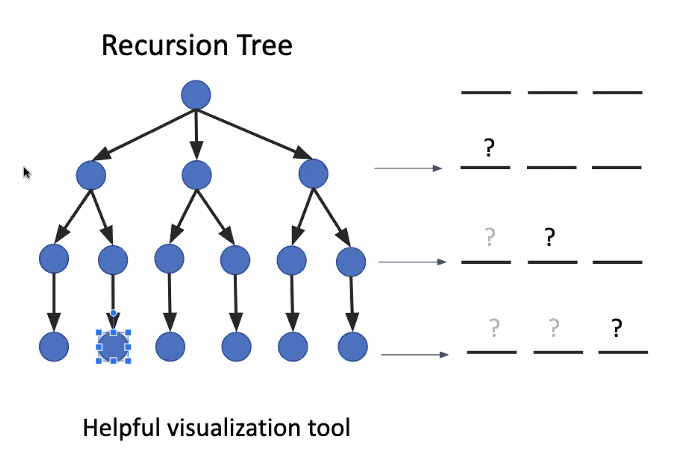
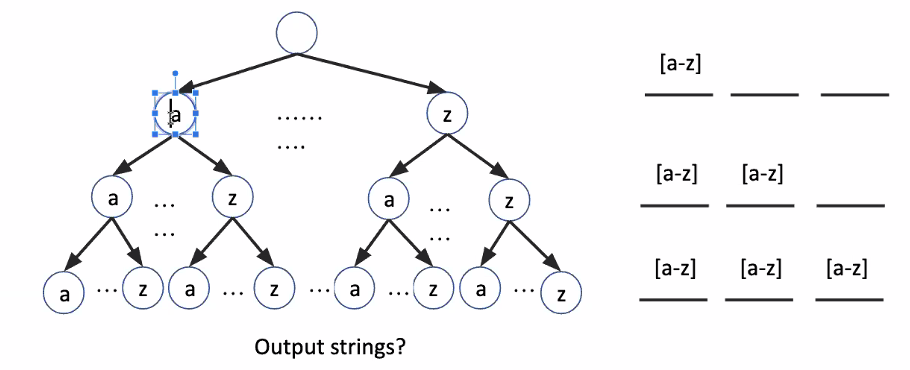

## Class Agenda: 

Part 1: Combinatorial Enumeration interview problems involving the generation of permutations and combinations
- Letter case permutations
- Subsets I
- Permutations I
- Permutations II
- Subsets II

Lunch/Dinner break

Part 2: Backtracking problems, involving the addition of a constraint filter on top of part 1
- Combinations
- Subset sum
- Generate Parentheses
- N-Queens


## Notes

### Questions

1. Where recursion is used?
	- Sorting, combinatorics , DP, Tree, Graphs

2. How would you explain recursion to a 4 year old?
	- My thought: repeating instructions until a solution is found
	- unpacking a present with multiple boxs instead until the last box opens to candy

3. 

-----

# Combinatorial problems

### Layers of complexity

```
	generate / enumerate all possilbe combos -> subsets, permutation

		|
		v

	Apply constraints or filters -> Backtracking (size, sum, cpacity)

		|
		v

	Perform optimization -> DP, greedy
```

### Runtime

- Exponential runtime
- generation (return, print)
- enumerate (how many)

### Mental Model

- fill in a series of blanks (recursion)
	- from left to right
- recursion tree

Every time we solve a problem ask these two questions:
1. How many blanks?
2. What our our choices?

After we have a choice, we must enumerate
Then we ask the same questions:
1. How many blanks
2. What are our choices?




For example:
	A problem with 3 blanks at each level it's one less choice.

#### Example Combinatorial problems

1. Generate all 3-letter strings (print or collect)
	- how many blanks? 3
	- how many choices? 26 choices: A-Z
	- The choices are the same for every blank meaning it's possible to repeat




Pseudo code:

```
driver() {
	helper(sub problems, partial solution)
}

helper(sub problems, partial solution) {
	if no more sub problems
		print or collect

	else 

		for each choice
			make a choice // add to partial solution
			helper(remaining sub problems, partial soltuion)
			unmake a choice // if mutable data structure if used
}
```

2. Letter case permutation - given a string S
	- transform every letter to lowercase or uppercase to create another string
	- return a list of all possible strings we could create

```
	example:
		input "t1D2"
		output ["t1D2", "t1d2", "T1D2", "T1d2"]

		input "12345"
		output ["123456"]
```

Ask the question:
1. How many blanks: 4 blanks, length of string
2. What are our choices?
	- blank 1: t or T
	- blank 2: 1 
	- blank 3: D or d
	- blank 4: 2


``` swift

func lowUpper(_ input: String, _ index: Int, slate: String, output: inout [String]) {
	
	if index == input.count { // base case
		output.append(slate); return // leaf level
	}

	let currentChar = input.char[index]

	// exploring choices
	if currentChar.isDigit() { // digit
		lowUpper(input, index+1, slate: slate+currentChar, output)
	} else { // letter
		// two choices; lowercase & uppercase
		lowUpper(input, index+1, slate: slate+currentChar.toLower, output)
		lowUpper(input, index+1, slate: slate+currentChar.toUpper, output)
	}

}

var result: [String] = []
helper("t1D2", 0, slate: "", output: &result)
print(result)

```

After you have the algorithm, you must be able to explain both:
1. time complexity
2. space complexity
3. (optionally) implicit space

#### Time complexity

O(2^n) @ leaf level

Number of nodes: (2^n+1)+1 if full binary tree if the string only contains letters

!important: to figure out how long it takes, take the `number of nodes times the number of calls`

If it is a digit:
	- O(n)

if it is a letter:
	- O(n)

>> Why is a letter only `O(n)` if we are calling it twice in else?
**A:** `n` because we append the final result to the array, which is taking O(n) time

#### Space complexity + Implicit space

`O(2^n * n)` where n is the size of the input string

where 2^n is all the node

where n is the height of the tree

##### Implicit space

Space from top to leaf node in a single path

`O(n^2)` or height of the tree

- formula:
	height of the tree (n) * amount of space per level (n) 

```
s(n) = O( _ * _ )
s(n) = O( n * n )
s(n) = O(n^2)

```

so in total:

```
s(n) = O(2^n * n + n^2)
```

>> I have no clue how they got there
**A:** The appending `slate+currentChar.toLower` is an implicit we can't control it but it's creating a new string each time. The height of the tree is `n`, 

-----

### Sandwich Model version

Using a buffer append instead of creating of passing a new string

``` pseudocode

func lowUpper(_ input: String, _ index: Int, slate: String, output: inout [String]) {
	
	if index == input.count { // base case
		output.append(slate.toString()); return // leaf level
	}

	let currentChar = input.char[index]

	// exploring choices
	if currentChar.isDigit() { // digit
		slate.append(currentChar)
		lowUpper(input, index+1, slate: slate, output)
		slate.removeLast // currentChar

	} else { // letter

		// two choices; lowercase & uppercase
		slate.append(currentChar.toLower)
		lowUpper(input, index+1, slate: slate, output)
		slate.removeLast // currentChar

		slate.append(currentChar.toUpper)
		lowUpper(input, index+1, slate: slate, output)
		slate.removeLast // currentChar
		
	}

}

var result: [String] = []
helper("t1D2", 0, slate: "", output: &result)
print(result)

```

